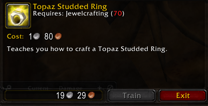
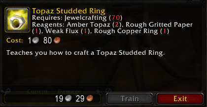

# CraftingClue by dandr94

In World of Warcraft 1.12 (including Turtle WoW), profession trainers do not display which reagents are required to learn a recipe. This addon fixes that.

**Game Version**: Made for Turtle WoW (1.12)

## Features

-   Adds a reagent list for each recipe in the Tradeskill Trainer window
-   Works for all profesions thanks to LibCrafts
-   Displays reagents number in red or gray depending on whether you have the needed materials in your bags
-   Seamlessly integrated into the default UI

**⚠️ Warning:**
If an item hasn’t been seen by your client yet, the addon will display a special message like:  
**_“Item [ID] (uncached). Please click on the recipe again to show.”_**  
This means the game needs to cache the item info first, so simply clicking the recipe again will update the reagent list correctly.

## Screenshots

### Before



### After



## Installation

1. Download the zip file

2. Unpack the Zip file

3. Rename the addon folder from "CraftingClue-main" to "CraftingClue"

4. Move the addon folder in your WoW folder, under - _Interface/AddOns_. Should look like this:

```bash
  Interface/AddOns/CraftingClue/
```

## Known and Possible Issues

-   **Some Reagents May Not Appear**:
    Certain recipe materials (e.g., Bolt of Silk Cloth) might not show in the reagent list. Even though they exist in LibCrafts, they will show as N/A. This is not yet fixed but affects only a few cases. Doubt it is a bug caused by LibCraft, high chance it is me.

-   **Occasional “Green Recipes” Bug**:
    Very rarely, all recipes in the trainer window may appear green (as if you can learn them). The cause is unknown and hard to reproduce. Closing and reopening the trainer window usually fixes it.

-   **Text Overlap with Cost**:
    Recipes with many or long reagent names may cause the reagent text to overlap with the cost displayed in the UI. The text field is not dynamically sized or repositioned.

## Acknowledgements

-   [LibCrafts-1.0](https://github.com/refaim/LibCrafts-1.0) by [Rafael](https://github.com/refaim/)

## Author Notes

This is my first addon, and I have no prior experience with the WoW addon system, Lua, or addon architecture in general. I got fed up with having to look online for the reagents of recipes I wanted to learn so I wouldn’t lose money, so I decided to make this small addon to fix my problem. I looked around and didn’t find an addon that does this — though it might exist and I just didn’t find it.
The code may not be clean or optimal, but it works well enough for me.
